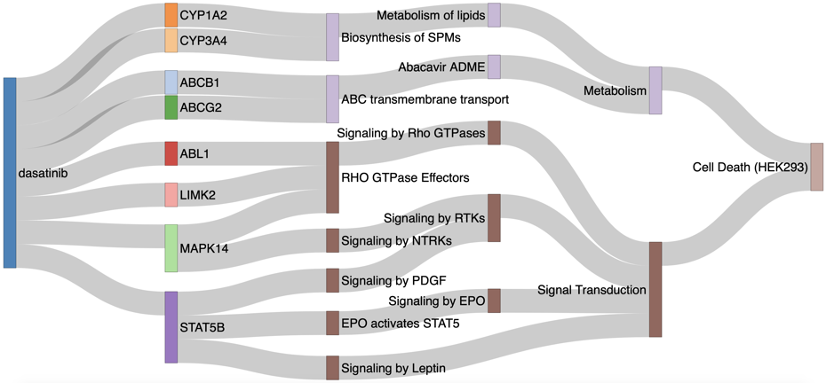

# AIDTox (ComptoxAI-incorporated DTox): an interpretation framework for knowledge-guided neural networks

 

## Introduction 

In computational toxicology, prediction of complex endpoints has always been challenging, as they often involve multiple distinct mechanisms. State-of-the-art models are either limited by low accuracy, or lack of interpretability due to their black-box nature. While our previous work [DTox](https://github.com/yhao-compbio/DTox) greatly improved the interpretability of toxicity prediction, it bears some limitations in the current form. For instance, the input feature profile of DTox that contains 361 target proteins is inferred from structure-based binding prediction models, which were trained on compound-target interaction datasets. As a result, some target proteins were excluded from the input feature profile of DTox if binding to these proteins cannot be well predicted from structure properties of compounds, or the number of available samples is insufficient for model construction. Fortunately, the recent development of a toxicology-focused graph database named ComptoxAI provides extensive knowledge on relations among chemicals and genes, thus may address the current limitation of DTox. Here we introduce AIDTox, an interpretable deep learning model which incorporates curated knowledge of chemical-gene connections, gene-pathway annotations, and pathway hierarchy. AIDTox accurately predicts cytotoxicity outcomes in HepG2 and HEK293 cells. It also expanded the original feature space of DTox by three folds, with significant supplement to target categories such as transporters, ion channels, cytochrome P450 enzymes. These target proteins play critical roles in drug metabolism and elimination, thus become a valuable asset for predicting and explaining the cytotoxic outcomes of drugs. In summary, AIDTox provides a computational framework for unveiling cellular mechanisms for complex toxicity endpoints. 

The codes to implement our pipeline can be found in [`src/`](src/), along with detailed documentation.

Detailed documentation about our results and figures can be found at [`data/`](data/) and [`plot/`](plot/), respectively.

